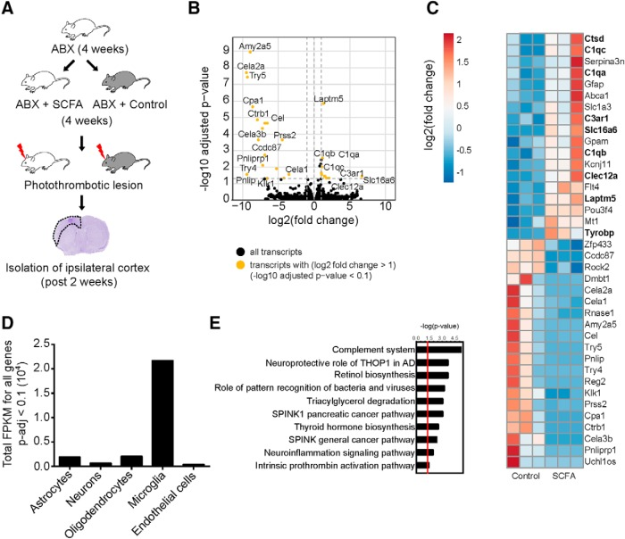

# Intro-to-RNAseq-analysis

```{r setup, include=FALSE}
knitr::opts_chunk$set(echo = TRUE)
```


We will now perform a fairly simple analysis of RNAseq data. This dataset comes
from another lab in our institute, AG Liesz, and was published in 2020: https://www.jneurosci.org/content/40/5/1162.long. Here the authors treated mice with short-chain fatty acids (produced by the gut microbiota) after stroke and found that it improved recovery.


Load the libraries: "DESeq2", "tidyverse", "EnhancedVolcano" and "clusterProfiler". 
Use the source function to source the "RNAseq_functions.R" file in the current working directory. 

```{r}

```
### Loading data 

Firstly we will read in the counts file and sample metadata using the ```read_tsv``` function from "readr", part of the "tidyverse". 

```{r}

```

Next we create a summarized experiment with the count data and sample metadata we just read in. A summarized experiment is an R object commonly used by bioconductor packages which simplifies and standardises storing genomic data in R.  

```{r}

```

In this analysis we will use the package DESeq2. DESeq2 is  one of the 
most common methods for detecting differentially expressed genes (DEGs) but also 
includes options for other types of analysis too. 
To load the data into DESeq2 to perform our analysis, we use the ```DESeqDataSet``` function, providing the summarized experiment and the design as a formula. In R we specify formulas using the ```~``` operator. Note that formulas do not require quotation. The variable on the left side is the dependent variable, while those on the right are the independent variables and are joined by ```+``` operators. 

e.g. Simple linear model - ```y ~ x```
     With two independent variables - ```y ~ x + b```
In our case the dependent variable or y, is the expression of a gene.     

Create a DESeq2 object called ```dds```using the DESeqDataSet function. 

```{r}

```
Although not strictly necessary, we can also remove genes with low counts across samples to speed up computation and filter unimportant features. Since the assay is just a matrix we can extract it with the ```counts``` function and use ```rowSums``` to calculate which indices are above a given sum, in this case: 10. 

```{r}

```

### Principal component analysis

Often we want to see how similar or different our samples are. A simple way to
do this, is to use principal component analysis or PCA. PCA attempts to find a 
linear combination of variables which best explain the variation in the data.  

```{r}

```

What does the PCA tell us? 

### Differential expression - which genes differ between conditions? 

Now we know our samples are different in terms of gene expression, we want
to find out which genes are altered between conditions.

To get our results we only need to run a single line of code. The ```DESeq```
function performs normalization, calculating 'size factors' to account for differences
in library depth and then estimate per-gene dispersion (variability). DESeq2 then 
uses a method called shrinkage to estimate more accurate estimates of variation which are
used in the final model. Finally, DESeq2 fits a negative binomial model to the data
and tests for differences in gene expression using a Wald test (default settings).

```{r}

```

To access the DESeq results call the results function with the DESeq2 object ```dds```` as 
an argument.

```{r}

```

Using the custom function ```annotate_degs``` let's add gene names and descriptions 
to our table. 

```{r}

```

Finally, we can plot the results as a volcano plot. The "EnhancedVolcano" 
package makes this very easy but the default plots are not always the nicest/most 
interpretable

Plot volcano using default settings 

```{r}

```


Let's tidy it up a bit by adding a few extra arguments and generating key-value
pairs for the colour scheme so that SCFA enriched genes are coloured in red and 
those enriched in the control group are coloured in blue. 

Additionally, we can specify, foldchange and adjusted p-value thresholds, remove the
titles,captions and legend and then adjust the limits of the x-axis and now our
plot looks a lot better. 

```{r}

```
### Gene Ontology 

Although here we only have a handful of significantly regulated genes in many
cases we can have hundreds or even thousands. Even with properly annotated gene 
names, this can make functional interpretation difficult, thus we often assign 
functional categories to our gene lists to help make sense of them. For the last
section of todays course, we will perform overrepresentation analysis, assigning
biological profiles to our DEGs and using a hypergeometric test to determine
whether any of these categories are overrepresented compared to background. 

Firstly, we remove any NA values from our DESeq2 results and create a background
of all the genes included in our differential expression test. 

```{r}

## Create background dataset for hypergeometric testing using all tested genes for significance in the results                 

```

Secondly, we extract the genes which were significantly different between
the SCFA and Control group. Since we have relatively few genes we are using a more
relaxed adjusted p-value filter of 0.1 and not filtering based on fold change. 

```{r}
## Extract significant results

```
Next we will perform the enrichment analysis using the ```enrichGO``` function
from the "clusterProfiler" package. 

```{r}

```

Let's plot the results using the ```dotplot``` function, by providing our enrichment
results from above as an argument. 

```{r}

```

How do your results compare to the original publication? 

```{r pressure, echo=FALSE, fig.cap="Fig. 3 Sadler et al 2020", out.width = '100%'}

```

