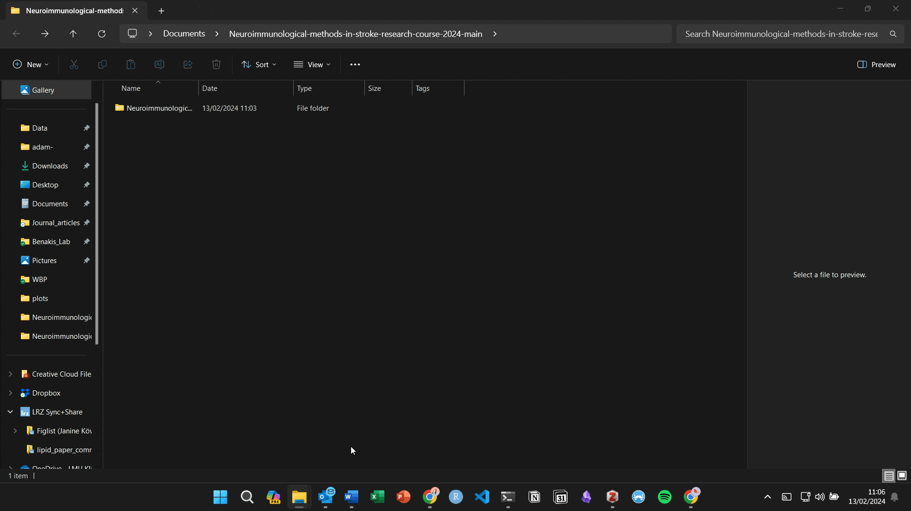

# Neuroimmunological-methods-in-stroke-research 

## Instructions 

## Download and install R and Rstudio

Download and install the specific version of R for your OS [here:](https://ftp.fau.de/cran/)
(If using Windows 10/11, please install [Rtools](https://cran.r-project.org/bin/windows/Rtools/rtools42/files/rtools42-5355-5357.exe) as well) 

Download and install [Rstudio](https://posit.co/download/rstudio-desktop/)

### Before we begin 

**Note that everything below is subject to change before the course begins on 25/07/24, please install the necessar R packages on the day of the course. 

Download the course content and extract the folder. 

  [](img/download_instructions.gif)

Navigate to the course folder (Neuroimmunological-methods-in-stroke-research-course-2024) and open the "install.R" file in Rstudio. Run the code by selecting all of the code and pressing run. 

  [](img/installation_instructions.gif)

If everything installed successfully, you should receive the following message: 

"Installed packages successfully :)" 

Please check everything works before the course starts.

## Course content 

## Intro-to-R 

Since some of you may not have any experience using R, we will very quickly go through some key concepts to help you understand better what we will doing in the analysis section later. 

### Mathematical operations 

Type and test these operations in the console in Rstudio 

Addition
```1 + 1```

Subtraction 
```5 - 4``` 

Multiplication 
```2 * 10```

Division
```9 / 3```

Modulo 
```20 %/% 6```

Square
```4^2 or 4**2``` 

### Comparison

Greater than
```>``` 

Less than 
```<``` 

Equals 
```==```

Does not equal 
```!=```

### Basic types 

There are 6 basic data types in R: logical, numeric, integer, character, raw and complex. Today (and in general) only the first four are important. 

```logical``` Can only have two values ```TRUE``` or ```FALSE``` (Shorthand:```T```,```F```). 

```numeric``` All numbers with or without decimal ```100.34```

```integer``` Whole numbers ```123L``` A number appended with L suffix denotes an integer in R

```character``` Character or string values. Enclosed in either single 'microbe' or double "stroke" quotes. 

### Variable assignment 

Variables are assigned in R using the ```<-``` operator. A variable can be though of a a "box" you store a value in for later use.

They can be used to store a value which you want to be constant throughout your code e.g. a file name 
``` r
x <- "Bacteria_data.txt" 
``` 
Or to save time by storing long strings/numbers 

``` r
y <- 127575738398292929
```

### Data structures 

Four most commonly used data structures 

#### 1D
Vectors - ordered collection of data of a given length and all of the same type:
``` r
vector1 <- c(1,3,7,8,9)
vector2 <- c("A", "B", "C", "D")
print(vector2)
```

Lists - ordered collection of data/objects of a given length. Can be composed of heterogenous types. 
``` r
list1 <- list(vector1, vector2)
list2 <- list(1,2,3)
print(list1)
```

#### 2D 

Matrices - 2D data structure (rows x columns) of the same type
``` r
m <- matrix(c(1, 2, 3, 4, 5, 6, 7, 8, 9), nrow = 3, ncol = 3)
print(m)
```

Dataframes - 2D heterogenous data structure (rows x columns)
``` r
df <- data.frame(bacteria = c("E. coli", "L. reuteri", "C. difficile"),
                 sample1 = c(10, 27, 61),
                 sample2 = c(9, 200, 43) )
print(df) 
```

Objects such as vectors and dataframes can also be stored in variables as you saw above. ```df``` and ```vector2``` are both variables. 

### Control flow

As well as writing individual statements like we have done above we can also use logic to control the flow of our code, allowing us to repeat bits of code or only run if a given condition is met. 

for loops allow us to repeat code a specified number of times e.g.

``` r
for (i in vector2){
  print(i)
 }
```

This prints out each element in the ```vector2```variable we defined earlier. Not particularly interesting though.. 
We will discover a more interesting use case later. 

if/else statements allow us to control the flow of our code better: 

``` r
x <- 100
y <- 10

if (x > y) {
  print("x is higher")
} else if (x < y) {
  print("y is higher")
}
```
Change the values of x and y and see how the output changes. 

### Functions 

Functions are used to abstract repetitive code in something which is reusable and modular, making code easier to read and debug. 

Using the above if else example we could create a function called ```greater_than``` which tells us which value is highest in a more modular way

``` r
greater_than <- function(x, y) {
  if (x > y) {
    print("x is higher")
  } else if (x < y) {
    print("y is higher")
  }
}
```

``` r
greater_than(x=100, y=10)
greater_than(x=1, y=17)
```

More interesting functions might perform a calculation for us and return the value 

``` r
normalise <- function(x) {
  x_norm <- t(100 * t(x) / colSums(x))
  return(x_norm)
}
```
Let's run this function on the matrix we created earlier to see what it does. 

``` r
normalise(m)
```

So far we have covered built-in functions and custom functions, but R has a huge 
open source library of packages called CRAN, as well as a specific repository
for bioinformatics, called bioconductor. 

### Loading external functions

When working with R, at some point you may find yourself requiring a specific 
function to perform some kind of analysis and plot data etc. It's usually the 
case that someone has already written a function for whatever you want to do

You can install packages to access functions written by others. 
External packages can be downloaded using the ```install.packages``` function 
and loaded using the ```library``` function. Somewhat annoyingly, bioconductor
packages are installed a little differently, and require you to first install
the "BiocManager" package and then install using ```biocManager::install```. They
can however be loaded as normal. 

If you need help with a function you can also type ?functionname in the console e.g. ?log10 and the help for that function will show up, detailing what the function does, what inputs it expects and what value(s) it returns. 

Once you get into writing your own functions, it's good practice to store them
in a separate R file and import them using the ```source``` function. 

### Data wrangling 

A few key concepts on loading and manipulating data. 

Reading data 
``` r
# load tidyverse
library(tidyverse)
# read in the palmer penguins csv file 
penguins <- read_csv("data/penguins.csv")
```

Manipulating data 

Selecting columns 

``` r
# select certain columns 
bill_length <- select(penguins, bill_length_mm) 
print(bill_length)
# using pipe operator
bill_length <- penguins %>% 
    select(bill_length_mm)
print(bill_length)
```

Filtering rows 

``` r
gentoo  <- filter(penguins, species == "Gentoo")
print(gentoo)
# with pipe 
gentoo <- penguins %>%
    filter(species == "Gentoo")
print(gentoo)
```

Filtering and selecting in one with the pipe operator 
``` r
gentoo_bill_length <- penguins %>%
    filter(species == "Gentoo") %>%
    select(bill_length_mm)
print(gentoo_bill_length)
```
Now we understand a little bit of R we are prepared for some data analysis 
this afternoon. 

## Analysis of Microbiota data

Here we will perform a very streamlined analysis of shotgun metagenomic data from 
mouse stool. This dataset comes from our lab but is currently not published. 

## Data Analysis 

Source the "Microbiome_functions.R" script. This contains functions for analysing shotgun metagenomic data which we will use today. 

``` r
source("Microbiome_functions.R")
```

Firstly, we will read the species abundance table(s) and metadata into R, using
phyloseq. 

``` r
ps <- import_pseq_metag("data/mouse_stool_abundances.txt","data/mouse_stool_metadata.txt", level = "Species")
```

Phyloseq is used as it provides a nice way of storing all the associated
data in one object or class. As you can see, the metadata and species abundance
table are all combined here into `ps`. Importantly, each part can also
be accessed invidivually.

## Data Normalisation

Here will transform the data to relative abundance (percentages), and also 
perform a method called rarefaction for downstream analyses.

### Why do we need to normalise? 

``` r
barplot(sort(sample_sums(ps)), horiz = TRUE, las = 2, xlab=NULL, main="Library sizes")
```


### How does normalisation work?


Relative, transforms each sample into compositions, on a fixed scale of
0-1 or 0-100.

``` r
ps_rel <- transform(ps)
```

We can see how this works by looking at the column sums:

``` r
colSums(otu_table(ps_rel))
```
Rarefaction, on the other hand, works by choosing a fixed number of samples equal to or less than the sample with the lowest number of reads, then randomly discarding reads from larger samples until the remaining sample size equals this threshold.

``` r
ps_rar <- rarefy_even_depth(ps, rngseed = 42)
```
``` r
colSums(otu_table(ps_rar))
```

## Alpha Diversity

Here we will calculate two different measures of alpha-diversity:

-   Species richness, or the number of observed species
-   Shannon effective diversity, measuring richness and evenness 

The function `calc_alpha` wraps all of these calculations and only
requires the rarified phyloseq object as input, returning a
dataframe with a column for each above-mentioned dataframe.

``` r
alpha_div <- calc_alpha(ps_rar)
```

### How are alpha diversity metrics calculated?

Richness here is calculated as the the total number of observed species
greater than 0.5 mss normalised abundance. This threshold is used to
exclude noise (see Lagkouvardos et al 2017, PeerJ and Reitmeier et al
2021, ISME Communication for a more thorough explanation).

Shannon effective diversity is calculated as the exponent of the Shannon
index:

$$H = -\\sum\_{i=1}^{R} p\_i ln(p\_i)$$
where *R* = richness, *p<sub>i</sub>* is the relative abundance of
species *i* and *ln* is the natural logarithm.

This metric accounts for both the abundance and evenness of taxa.


### Plotting

To plot the alpha diversity metrics we will use a boxplot with jittered
points layered on top. The function `plot_boxplot`will do this for you,
we just need to set some parameters first.

Firstly, we will list the statistical comparisons we want to make, by
creating a list of vectors. In this case we only have two groups, stroke
and sham which can be written like: `list(c("Stroke", "Sham"))`. If we
had an extra group, for example, “Control”, we would then have three
comparisons to define like so:
`list(c("Control", "Sham"), c("Control", "Stroke"), c("Sham", "Stroke"))`


``` r
head(alpha_div)
```


Comparisons list

``` r
comparisons <- list(c("Stroke", "Sham"))
```

We can also specify the colours we want to use in our plots here by
creating a named vector of colours.

``` r
colour_pal <- c("sham" = "#98C1D9", "stroke"= "#EE6C4D")
```

To generate the plot we need to provide the dataframe, the name of the
column containing the grouping variable (in this case "condition”),
the name of the column containing the values to plot ("Richness"). To
colour by group we provide the column name of the grouping variable to
`fill_var`. We can then add the list of comparisons, some x and y-axis,
a title if desired, and the plot colours.

In instances where the alphabetical order of your group levels does not
match the order you would like to plot them in, you can specify the order
explicitly with the `group.order`parameter.

#### Richness

``` r
plot_boxplot(alpha_div, variable_col = "condition", value_col = "Richness", 
             comparisons_list = comparisons, fill_var = "condition", 
             group.order = c("sham", "stroke"), cols = colour_pal)
```


``` r
plot_boxplot(alpha_div, variable_col = "condition", value_col = "Shannon.Effective", 
             comparisons_list = comparisons, fill_var = "condition", 
             group.order = c("sham", "stroke"), cols = colour_pal)
```


Do stroke and sham mice show any differences in alpha-diversity? 

## Microbiome composition

In addition to examining within sample diversity (alpha-diversity), we also
usually want to know how different certain groups of samples are, in case, whether
sham and stroke differ in terms of microbiota composition. 

### Taxonomic composition - overview 

One very simple way to do this, which can give us a fairly rough picture of whether
our groups are different is to simply plot the taxonomic composition, looking
at the most abundant species. 

To plot composition we need to provide phyloseq object containing relative abundances, 
the taxonomic level we would like to plot, in this case species. In addition, 
we need to supply the group column (without quotes), 
the number of species we would like to plot and can additionally specify several additional 
parameters to customise the order and calculation of the most abundant taxa.
``` r
p <-
  plot_taxonomic_comp(
    ps_rel,
    "Species",
    condition,
    n_taxa = 12,
    ord = c("sham", "stroke"),
    per_group = T,
    groups = c("sham", "stroke")
  )
print(p)
```


Is the taxonomic composition of stroke and sham mice different at the species level? 


### Beta Diversity

Here we will calculate beta-diversity based on Bray-Curtis
distance and plot an ordination of this using Non-metric
multidimensional scaling.

The `calc_betadiv` function calculates a distance matrix, and an
ordination of that matrix, returning both as a list.

Various dissimilarity indices are available:

-   Bray-Curtis - A count-based dissimilarity metric (beta-diversity),
    based on the fraction of overabundant counts.
-   Jaccard - Fraction of unique features. Does not consider abundance. 


Similarly, there are also various ordination options:

-   NMDS (default) - Non-Metric Multidimensional Scaling. An ordination
    method which attempts to represent the dissimilarity between
    samples, as closely as possible in a low-dimensional space.
-   MDS/PCoA - Principal Coordinate analysis (also known as Metric
    Multidimensional Scaling). An ordination method which attempts to
    preserve distance between samples in a low dimensional Euclidean
    space.

``` r
beta_div <- calc_betadiv(ps_rar, dist = "bray", ord_method = "NMDS")
```

To plot beta diversity a convenience function `plot-beta_div` is
provided. We just need to provide the phyloseq object and the betadiv 
object from above, a grouping variable and again the colour palette, if desired.

Within this function statistical testing of group separation is also
carried out using the adonis function of vegan. This function performs a
Permutational Multivariate Analysis of Variance or PERMANOVA test. The
resulting R<sup>2</sup> and p-value are added to the plot in the bottom
left.

The adonis R<sup>2</sup> represents the amount of variance in microbiome 
composition explained by the variable being tested, in this case condition. The
accompanying p-value denotes whether or not this effect is significant. 

``` r
plot_beta_div(ps_rar, beta_div, group_variable = "condition",cols = colour_pal, add_ellipse = T)
```


What do you interpret from this plot? 

## Differential abundance

The final step of this pipeline is to calculate differentially abundant
taxa between conditions.

This function performs the ancom-bc test, a compositionally aware
differential abundance method and returns significant results. As input,
only the phyloseq object and the column name of the grouping variable is
required.

``` r
da_taxa <- maaslin2_tax(
    ps_rel,
    out = "microbiome_DA_results",
    fixed = "condition",
    abun_thresh = 1e-4,
    prev_thresh = 0.3
)$results
```

To visualise differentially abundant taxa, we provide a function which
calculates fold change of significant taxa from above and plots
diverging dot plot coloured by group, providing a clear figure showing
which taxa change between conditions.

To this function, we need to provide the results of the ancom test
above, an ordered vector of the group levels e.g. ```c("Sham", "Stroke")```.
Additionally, we can provide the group colours to make interpretation
easier.

``` r
plot_da(da_taxa, groups = c("sham", "stroke"), cols = colour_pal)
```


What can we say about microbiome changes 3 days after experimental stroke?

# Intro-to-RNAseq-analysis

We will now perform a fairly simple analysis of RNAseq data. This dataset comes
from another lab in our institute, AG Liesz, and was published a few years back: https://www.jneurosci.org/content/40/5/1162.long. Here the authors treated mice with short-chain fatty acids (produced by the gut microbiota) after stroke and found that it improved recovery.


Load the libraries: "DESeq2", "tidyverse", "EnhancedVolcano" and "clusterProfiler". 
Use the source function to source the "RNAseq_functions.R" file in the current working directory. 

``` r
library(EnhancedVolcano)
library(DESeq2)
library(tidyverse)
library(clusterProfiler)
source("RNAseq_functions.R")
```

### Loading data 

Firstly we will read in the counts file and sample metadata using the ```read_tsv``` function from "readr", part of the "tidyverse". 

``` r
counts <- read_tsv("data//GSE131788_counts_upload.SCFA_treatment.refseq_mm10.txt") %>% 
  # since we require our data to be numerical we need to move the first column to the rownames
  column_to_rownames("RefSeq") %>% 
  # deseq requires our data to be in matrix form 
  as.matrix()
metadata <- read_tsv("data//metadata_SCFA.txt")
```
Next we create a summarized experiment with the count data and sample metadata we just read in. A summarized experiment is an R object commonly used by bioconductor packages which simplifies and standardises storing genomic data in R.  

``` r
se <- SummarizedExperiment(assays=list(counts=counts),colData = metadata)
```

In this analysis we will use the package DESeq2. DESeq2 is  one of the 
most common methods for detecting differentially expressed genes (DEGs) but also 
includes options for other types of analysis too. 
To load the data into DESeq2 to perform our analysis, we use the ```DESeqDataSet``` function, providing the summarized experiment and the design as a formula. In R we specify formulas using the ```~``` operator. Note that formulas do not require quotation. The variable on the left side is the dependent variable, while those on the right are the independent variables and are joined by ```+``` operators. 

e.g. Simple linear model - ```y ~ x```
     With two independent variables - ```y ~ x + b```
In our case the dependent variable or y, is the expression of a gene.     

Create a DESeq2 object called ```dds```using the DESeqDataSet function. 

``` r
dds <- DESeqDataSet(se, design = ~ treatment)
```
Although not strictly necessary, we can also remove genes with low counts across samples to speed up computation and filter unimportant features. Since the assay is just a matrix we can extract it with the ```counts``` function and use ```rowSums``` to calculate which indices are above a given sum, in this case: 10. 

``` r
keep <- rowSums(counts(dds)) >= 10
dds <- dds[keep,]
```

### Principal component analysis

Often we want to see how similar or different our samples are. A simple way to
do this, is to use principal component analysis or PCA. PCA attempts to find a 
linear combination of variables which best explain the variation in the data.  

``` r
vsd <- vst(dds, blind = T, fitType = "local")
plotPCA(vsd, intgroup=c("treatment")) + 
  theme_bw()
```


What does the PCA tell us? 


### Differential expression - which genes differ between conditions? 

Now we know our samples are different in terms of gene expression, we want
to find out which genes are altered between conditions.

To get our results we only need to run a single line of code. The ```DESeq```
function performs normalization, calculating 'size factors' to account for differences
in library depth and then estimate per-gene dispersion (variability). DESeq2 then 
uses a method called shrinkage to estimate more accurate estimates of variation which are
used in the final model. Finally, DESeq2 fits a negative binomial model to the data
and tests for differences in gene expression using a Wald test (default settings).

``` r
dds <- DESeq(dds)
```
To access the DESeq results call the results function with the DESeq2 object ```dds```` as 
an argument.

``` r
res <- results(dds)
```

Using the custom function ```annotate_degs``` let's add gene names and descriptions 
to our table. 

``` r
res_annot <- annotate_degs(org.Mm.eg.db, res, keys = row.names(res), 
                           keytype = "REFSEQ", multivals = "first") %>% 
as.data.frame()
```

Finally, we can plot the results as a volcano plot. The "EnhancedVolcano" 
package makes this very easy but the default plots are not always the nicest/most 
interpretable

Plot volcano using default settings 

``` r
EnhancedVolcano(res_annot,lab = res_annot$gene_symbol, x = "log2FoldChange", y = "padj")
```


Let's tidy it up a bit by adding a few extra arguments and generating key-value
pairs for the colour scheme so that SCFA enriched genes are coloured in red and 
those enriched in the control group are coloured in blue. 

Additionally, we can specify, foldchange and adjusted p-value thresholds, remove the
titles,captions and legend and then adjust the limits of the x-axis and now our
plot looks a lot better. 

``` r
keyvals <- ifelse(
  res_annot$log2FoldChange < -1 & res_annot$padj < 0.1, 'dodgerblue',
    ifelse(res_annot$log2FoldChange > 1 & res_annot$padj < 0.1, 'firebrick1',
        'gray87'))
keyvals[is.na(keyvals)] <- 'gray87'
names(keyvals)[keyvals == 'firebrick1'] <- 'SCFA'
names(keyvals)[keyvals == 'dodgerblue'] <- 'Control'


EnhancedVolcano(res_annot, lab = res_annot$gene_symbol, x = "log2FoldChange", y = "padj", pCutoff = 0.1,
                FCcutoff = 1, xlim = c(-10, 10), title = NULL, subtitle = NULL, caption = NULL, 
                 colCustom = keyvals,colAlpha = 1, legendPosition = "None")
```


### Gene Ontology 

Although here we only have a handful of significantly regulated genes in many
cases we can have hundreds or even thousands. Even with properly annotated gene 
names, this can make functional interpretation difficult, thus we often assign 
functional categories to our gene lists to help make sense of them. For the last
section of todays course, we will perform overrepresentation analysis, assigning
biological profiles to our DEGs and using a hypergeometric test to determine
whether any of these categories are overrepresented compared to background. 

Firstly, we remove any NA values from our DESeq2 results and create a background
of all the genes included in our differential expression test. 

``` r
res_annot_noNA <-  res_annot %>% 
  drop_na(padj)
## Create background dataset for hypergeometric testing using all tested genes for significance in the results                 
allOE_genes <- as.character(res_annot_noNA$gene_symbol)
```
Secondly, we extract the genes which were significantly different between
the SCFA and Control group. Since we have relatively few genes we are using a more
relaxed adjusted p-value filter of 0.1 and not filtering based on fold change. 

``` r
## Extract significant results
sigOE_genes <- res_annot_noNA %>% 
  filter(padj < 0.1) %>% 
  pull(gene_symbol)
```
Next we will perform the enrichment analysis using the ```enrichGO``` function
from the "clusterProfiler" package. 

``` r
## Run GO enrichment analysis 
ego <- enrichGO(gene = sigOE_genes, 
                universe = allOE_genes,
                keyType = "SYMBOL",
                OrgDb = org.Mm.eg.db, 
                ont = "BP", 
                pAdjustMethod = "BH", 
                qvalueCutoff = 0.1, 
                readable = TRUE)
```

Let's plot the results using the ```dotplot``` function, by providing our enrichment
results from above as an argument. 

``` r
dotplot(ego)
```


How do your results compare to the original publication? 

  [](img/RNA_seq_original_res.jpg)

